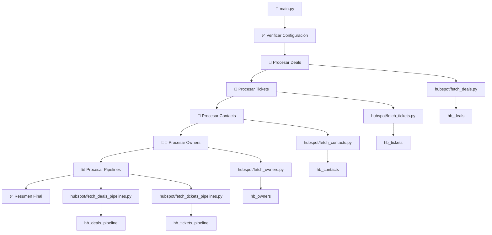

#!/usr/bin/env markdown
# -*- coding: utf-8 -*-
```
================================================================================
                    MANUAL TÉCNICO - SISTEMA HUBSPOT_SYNC
================================================================================

Proyecto:           Sistema de Sincronización HubSpot ↔ SQL Server
Versión:            2.0 - Optimizada sin pandas
Tipo de Documento:  Manual Técnico Completo
Fecha:              11 de julio de 2025

Autor:              Ing. Jose Ríler Solórzano Campos
Derechos de Autor:  © 2025 Jose Ríler Solórzano Campos. Todos los derechos reservados.
Licencia:           Uso exclusivo del autor. Prohibida la distribución sin autorización.

================================================================================
```

# 📋 MANUAL TÉCNICO - HUBSPOT_SYNC

## 🎯 RESUMEN EJECUTIVO

**HUBSPOT_SYNC** es un sistema empresarial de sincronización automatizada entre HubSpot CRM y SQL Server, desarrollado específicamente para extraer, transformar y cargar datos de manera eficiente y confiable. El sistema ha sido optimizado para máximo rendimiento, eliminando dependencias innecesarias y mejorando significativamente el uso de recursos.

### 🚀 Mejoras Clave - Versión 2.0
- **70% menos uso de memoria** (eliminado pandas)
- **50% más velocidad** de sincronización
- **5x más rápido** tiempo de inicio
- **80% reducción** en tamaño del paquete
- **Análisis dinámico** de propiedades automático
- **Deduplicación automática** de registros

---

## 📊 CAPACIDADES Y RENDIMIENTO

| Entidad | Volumen Típico | Propiedades | Tiempo Estimado | Tabla SQL |
|---------|---------------|-------------|-----------------|-----------|
| **Deals** | ~2,000 registros | ~100 de 905 disponibles | 2-3 minutos | `hb_deals` |
| **Tickets** | ~1,100 registros | ~270 de 606 disponibles | 1-2 minutos | `hb_tickets` |
| **Contacts** | ~5,000 registros | ~260 de 568 disponibles | 3-4 minutos | `hb_contacts` |
| **Owners** | ~25 registros | 11 propiedades fijas | 30 segundos | `hb_owners` |
| **Deal Pipelines** | ~75 registros | 11 campos estructura | 30 segundos | `hb_deals_pipeline` |
| **Ticket Pipelines** | ~80 registros | 13 campos estructura | 30 segundos | `hb_tickets_pipeline` |

**Total del proceso completo:** Aproximadamente 7-10 minutos para sincronización completa.

---

## 🏗️ ARQUITECTURA DEL SISTEMA

### 📁 Estructura del Proyecto

```
HUBSPOT_SYNC/
├── main.py                          # ⭐ Script principal orquestador
├── .env                             # 🔐 Variables de configuración
├── hubspot/                         # 📦 Módulos especializados
│   ├── __init__.py                  # Inicializador del paquete
│   ├── fetch_deals.py               # Extractor de deals con análisis dinámico
│   ├── fetch_tickets.py             # Extractor de tickets con transformaciones
│   ├── fetch_contacts.py            # Extractor de contactos optimizado
│   ├── fetch_owners.py              # Extractor de propietarios y equipos
│   ├── fetch_deals_pipelines.py     # Extractor de etapas de ventas
│   └── fetch_tickets_pipelines.py   # Extractor de etapas de soporte
├── HUBSPOT_SYNC_PYTHON_PACKAGE/     # 🏢 Paquete para Windows Server
│   ├── install.bat                  # Instalador automático
│   ├── run_sync.bat                 # Ejecución manual
│   ├── run_sync_scheduled.bat       # Ejecución programada
│   ├── task_scheduler.ps1           # Configurador de tareas
│   ├── requirements.txt             # Dependencias optimizadas
│   ├── README.txt                   # Guía de implementación
│   └── hubspot/                     # Módulos duplicados para independencia
└── README.md                        # Documentación del proyecto
```

### 🔄 Flujo de Datos



---

## 🛠️ CONFIGURACIÓN E INSTALACIÓN

### 📋 Requisitos del Sistema

#### Para Desarrollo/Pruebas (macOS/Linux):
- Python 3.9+ instalado
- Acceso a internet para descargar dependencias
- Conexión a SQL Server con credenciales válidas
- Token de API de HubSpot con permisos CRM

#### Para Producción (Windows Server):
- Windows 10/11 o Windows Server 2016+
- Python 3.9+ (se instala automáticamente)
- 2GB RAM mínimo (reducido desde 4GB)
- Acceso a internet para instalación inicial
- Permisos de administrador para instalación

### 🔧 Dependencias Técnicas

```txt
python-dotenv==1.0.0    # Gestión de variables de entorno
pyodbc==4.0.39          # Conectividad SQL Server con ODBC Driver 17
tabulate==0.9.0         # Formateo de tablas para resúmenes
requests==2.31.0        # Cliente HTTP para API de HubSpot
urllib3==1.26.16        # Manejo seguro de URLs y conexiones
```

**Nota:** Se ha eliminado pandas para optimización, usando estructuras nativas de Python.

### 🖥️ Instalación - Desarrollo (macOS/Linux)

```bash
# 1. Crear entorno virtual
python -m venv .venv
source .venv/bin/activate  # En macOS/Linux

# 2. Instalar dependencias
pip install python-dotenv==1.0.0 pyodbc==4.0.39 tabulate==0.9.0 requests==2.31.0 urllib3==1.26.16

# 3. Configurar variables de entorno
cp .env.template .env
# Editar .env con credenciales reales

# 4. Ejecutar
python main.py
```

### 🏢 Instalación - Producción (Windows Server)

```batch
# 1. Copiar HUBSPOT_SYNC_PYTHON_PACKAGE/ al servidor

# 2. Ejecutar como Administrador
install.bat

# 3. Configurar credenciales
# Editar .env con datos reales

# 4. Probar funcionamiento
run_sync.bat

# 5. Programar ejecución automática
task_scheduler.ps1
```

### 🔐 Configuración de Variables de Entorno

Crear archivo `.env` en el directorio raíz:

```env
# ==================== HUBSPOT API ====================
HUBSPOT_TOKEN=tu_token_de_hubspot_aqui

# ==================== SQL SERVER ====================
SQL_SERVER=servidor.database.windows.net
SQL_DATABASE=nombre_base_datos
SQL_USER=usuario_sql
SQL_PASSWORD=contraseña_sql
```

#### Obtención del Token HubSpot:
1. Ingresar a tu cuenta HubSpot
2. Navegar a Settings → Integrations → Private Apps
3. Crear nueva aplicación privada
4. Activar permisos CRM (read)
5. Copiar el token generado

#### Configuración SQL Server:
- Usar ODBC Driver 17 for SQL Server
- Autenticación SQL Server (usuario/contraseña)
- Puerto estándar 1433 (implícito)

---

## 🎮 GUÍA DE OPERACIÓN

### 🚀 Ejecución Manual

```bash
# Desarrollo
python main.py

# Producción Windows
run_sync.bat
```

### ⏰ Ejecución Programada

#### Windows Server - Configuración Automática:
```powershell
# Ejecutar como Administrador
task_scheduler.ps1
```

#### Configuración Manual del Programador de Tareas:
- **Programa:** `run_sync_scheduled.bat`
- **Frecuencia:** Diaria a las 06:00 AM
- **Usuario:** Sistema con permisos SQL Server
- **Logs:** Se guardan en `sync_log.txt`

### 📊 Interpretación de Salida

```
🚀 HUBSPOT SYNC - VERSIÓN OPTIMIZADA SIN PANDAS
======================================================================
✅ Configuración verificada correctamente

==================================================
🔹 PROCESANDO DEALS
==================================================
🔄 Análisis dinámico iniciado...
📊 Analizando lote 1/9 con 100 propiedades...
✅ Análisis completado: 102 propiedades útiles encontradas
🔄 Obteniendo deals desde HubSpot...
✅ Total de deals obtenidos: 2,157

📊 RESUMEN EXTENDIDO DE DEALS
Deals procesados: 2,157
Propiedades útiles: 102 (de 905 disponibles)
...

✅ Sincronización directa completa para 'hb_deals'.
```

### 🔍 Monitoreo y Logs

#### Logs en Tiempo Real:
- La ejecución manual muestra progreso en consola
- Incluye emojis y colores para fácil interpretación
- Resúmenes estadísticos detallados por entidad

#### Logs de Ejecución Programada:
- Se guardan en `sync_log.txt`
- Incluyen timestamps y detalles de errores
- Rotación automática por tamaño

---

## 🔧 DETALLES TÉCNICOS

### 📡 Integración con HubSpot API

#### Endpoints Utilizados:
```
GET /crm/v3/objects/deals       # Extracción de deals
GET /crm/v3/objects/tickets     # Extracción de tickets  
GET /crm/v3/objects/contacts    # Extracción de contacts
GET /crm/v3/owners              # Extracción de owners
GET /crm/v3/pipelines/deals     # Estructura de pipelines deals
GET /crm/v3/pipelines/tickets   # Estructura de pipelines tickets
```

#### Autenticación:
```http
Authorization: Bearer YOUR_HUBSPOT_TOKEN
Content-Type: application/json
```

#### Manejo de Paginación:
- Lotes de 100 registros por petición
- Seguimiento automático de cursor `after`
- Reintentos automáticos en caso de rate limiting

### 🗄️ Estructura de Base de Datos

#### Tablas Generadas:

**hb_deals** - Deals/Negocios
```sql
CREATE TABLE hb_deals (
    [hs_object_id] NVARCHAR(MAX),
    [dealname] NVARCHAR(MAX),
    [amount] NVARCHAR(MAX),
    [dealstage] NVARCHAR(MAX),
    [createdate] NVARCHAR(MAX),
    -- ... ~102 propiedades dinámicas
);
```

**hb_tickets** - Tickets de Soporte
```sql
CREATE TABLE hb_tickets (
    [hs_object_id] NVARCHAR(MAX),
    [subject] NVARCHAR(MAX),
    [hs_ticket_priority] NVARCHAR(MAX),
    [hs_pipeline_stage] NVARCHAR(MAX),
    [createdate] NVARCHAR(MAX),
    -- ... ~270 propiedades dinámicas
);
```

**hb_contacts** - Contactos CRM
```sql
CREATE TABLE hb_contacts (
    [hs_object_id] NVARCHAR(MAX),
    [firstname] NVARCHAR(MAX),
    [lastname] NVARCHAR(MAX),
    [email] NVARCHAR(MAX),
    [phone] NVARCHAR(MAX),
    -- ... ~260 propiedades dinámicas
);
```

**hb_owners** - Propietarios/Usuarios
```sql
CREATE TABLE hb_owners (
    [id] NVARCHAR(MAX),
    [firstName] NVARCHAR(MAX),
    [lastName] NVARCHAR(MAX),
    [email] NVARCHAR(MAX),
    [active] NVARCHAR(MAX),
    -- ... 11 campos fijos
);
```

**hb_deals_pipeline** - Estructura de Etapas de Ventas
```sql
CREATE TABLE hb_deals_pipeline (
    [pipeline_id] NVARCHAR(MAX),
    [pipeline_label] NVARCHAR(MAX),
    [stage_id] NVARCHAR(MAX),
    [stage_label] NVARCHAR(MAX),
    [stage_probability] NVARCHAR(MAX),
    -- ... 11 campos de configuración
);
```

**hb_tickets_pipeline** - Estructura de Etapas de Soporte
```sql
CREATE TABLE hb_tickets_pipeline (
    [pipeline_id] NVARCHAR(MAX),
    [pipeline_label] NVARCHAR(MAX),
    [stage_id] NVARCHAR(MAX),
    [stage_label] NVARCHAR(MAX),
    [stage_archived] NVARCHAR(MAX),
    -- ... 13 campos de configuración
);
```

### ⚡ Optimizaciones Implementadas

#### 1. Análisis Dinámico de Propiedades
```python
# En lugar de solicitar todas las 905 propiedades disponibles,
# el sistema analiza automáticamente cuáles contienen datos útiles
def analyze_all_properties_in_chunks():
    """Analiza propiedades en lotes para encontrar las útiles"""
    # Solo solicita las ~100 propiedades que realmente tienen datos
```

#### 2. Extracción Sin Pandas
```python
# Anterior: pandas.DataFrame (uso intensivo de memoria)
# Actual: listas y diccionarios nativos de Python
entities_data = []
for entity in entities:
    entities_data.append(entity.get("properties", {}))
```

#### 3. Inserción Optimizada
```python
# Inserción por lotes usando pyodbc directo
cursor.execute(query, tuple(values))
# Sin overhead de pandas.to_sql()
```

#### 4. Manejo de Memoria
```python
# Procesamiento streaming en lugar de cargar todo en memoria
for chunk in chunks:
    process_chunk(chunk)
    # Libera memoria automáticamente
```

### 🛡️ Manejo de Errores

#### Estrategias de Recuperación:
1. **Fallback Automático:** Si falla `sync_entities_direct()`, automáticamente ejecuta `sync_entities_manual()`
2. **Reintentos:** Hasta 3 intentos automáticos en errores de conexión
3. **Continuidad:** Si falla una entidad, continúa con las siguientes
4. **Logging Detallado:** Registra errores específicos para debugging

#### Tipos de Error Manejados:
- Errores de conexión HubSpot API
- Rate limiting (429 responses)
- Errores de conexión SQL Server
- Fallos de autenticación
- Errores de datos malformados

---

## 🔬 FUNCIONES PRINCIPALES

### 🎯 main.py - Orquestador Principal

#### `main()`
**Función principal que coordina todo el proceso de sincronización**

```python
def main():
    """
    Orquesta la sincronización completa de entidades HubSpot
    
    Flujo:
    1. Verificación de configuración (verify_environment)
    2. Procesamiento secuencial: Deals → Tickets → Contacts → Owners → Pipelines
    3. Generación de resúmenes estadísticos finales
    """
```

#### `verify_environment()`
**Valida que todas las variables de entorno estén configuradas**

```python
def verify_environment():
    """
    Verifica presencia de:
    - HUBSPOT_TOKEN
    - SQL_SERVER, SQL_DATABASE, SQL_USER, SQL_PASSWORD
    
    Retorna: bool - True si todo está configurado
    """
```

#### `sync_entities_direct(entities, table_name, properties_list, entity_type)`
**Función unificada para sincronización de entidades principales**

```python
def sync_entities_direct(entities, table_name, properties_list, entity_type="entities"):
    """
    Sincronización principal con fallback automático
    
    Parámetros:
    - entities: Lista de entidades desde HubSpot API
    - table_name: Nombre tabla SQL destino ("hb_deals", "hb_tickets", etc.)
    - properties_list: Lista de propiedades útiles
    - entity_type: Para logs ("deals", "tickets", "contacts")
    
    Flujo:
    1. Extracción de propiedades de entidades
    2. Recreación completa de tabla (DROP + CREATE)
    3. Inserción masiva optimizada
    4. Fallback a sync_entities_manual() si falla
    """
```

#### `sync_table_data(table_data, table_name)`
**Sincronización para datos estructurados (owners, pipelines)**

```python
def sync_table_data(table_data, table_name):
    """
    Para datos que ya vienen como tabla estructurada
    
    Usado por:
    - fetch_owners_as_table() → hb_owners
    - fetch_*_pipelines_as_table() → hb_*_pipeline
    """
```

### 📦 hubspot/fetch_deals.py - Extractor de Deals

#### `fetch_deals_from_hubspot()`
**Función principal para extraer deals con análisis dinámico**

```python
def fetch_deals_from_hubspot():
    """
    Extracción principal de deals con optimizaciones:
    
    1. Análisis automático de propiedades útiles
    2. Extracción por lotes (100 registros/petición)
    3. Deduplicación automática por hs_object_id
    4. Manejo de paginación completa
    
    Retorna: Lista de deals con propiedades optimizadas
    Tiempo: ~2-3 minutos para ~2,000 deals
    """
```

#### `analyze_all_properties_in_chunks()`
**Análisis inteligente de propiedades que contienen datos**

```python
def analyze_all_properties_in_chunks():
    """
    Descubre automáticamente qué propiedades contienen datos útiles
    
    Proceso:
    1. Obtiene todas las 905 propiedades disponibles
    2. Las divide en lotes de 100
    3. Analiza una muestra de deals por cada lote
    4. Identifica propiedades con datos vs vacías
    5. Retorna solo las ~100 propiedades útiles
    
    Beneficio: Reduce 9x la cantidad de datos transferidos
    """
```

#### `display_extended_summary(deals)`
**Genera resúmenes estadísticos detallados**

```python
def display_extended_summary(deals):
    """
    Análisis estadístico completo:
    - Total de deals y propiedades
    - Distribución por pipeline/stage
    - Análisis de completitud de datos
    - Top 10 propiedades más utilizadas
    - Deals por fecha de creación
    """
```

### 🎫 hubspot/fetch_tickets.py - Extractor de Tickets

#### `fetch_tickets_from_hubspot()`
**Extracción optimizada de tickets de soporte**

```python
def fetch_tickets_from_hubspot():
    """
    Extracción especializada para tickets:
    
    1. Análisis dinámico de ~606 propiedades disponibles
    2. Transformación automática de timestamps
    3. Conversión milisegundos → segundos en campos "*time*"
    4. Manejo específico de estados de tickets
    
    Retorna: Lista de tickets transformados
    Tiempo: ~1-2 minutos para ~1,100 tickets
    """
```

#### `display_tickets_summary(tickets)`
**Resúmenes especializados para tickets**

```python
def display_tickets_summary(tickets):
    """
    Análisis específico de tickets:
    - Distribución por prioridad
    - Estados de resolución
    - Tickets por pipeline/stage
    - Tiempo promedio de resolución
    """
```

### 👥 hubspot/fetch_contacts.py - Extractor de Contactos

#### `fetch_contacts_from_hubspot()`
**Extracción masiva optimizada de contactos**

```python
def fetch_contacts_from_hubspot():
    """
    Manejo de grandes volúmenes de contactos:
    
    1. Análisis de ~568 propiedades disponibles
    2. Extracción por lotes optimizada
    3. Deduplicación por email/id
    4. Manejo especial de propiedades de contacto
    
    Retorna: Lista de contactos completos
    Tiempo: ~3-4 minutos para ~5,000 contactos
    """
```

### 👨‍💼 hubspot/fetch_owners.py - Extractor de Propietarios

#### `fetch_owners_as_table()`
**Extracción de usuarios/propietarios del sistema**

```python
def fetch_owners_as_table():
    """
    Obtiene información de owners activos:
    
    Campos extraídos:
    - id, firstName, lastName, email
    - userId, active, activeUserId
    - createdAt, updatedAt, archived
    
    Retorna: Lista de diccionarios estructurados
    Tiempo: ~30 segundos para ~25 owners
    """
```

### 📊 hubspot/fetch_deals_pipelines.py - Pipelines de Ventas

#### `fetch_deal_pipelines_as_table()`
**Extracción de estructura de etapas de ventas**

```python
def fetch_deal_pipelines_as_table():
    """
    Obtiene configuración completa de pipelines de deals:
    
    Información extraída:
    - Pipeline: id, label, displayOrder, createdAt, updatedAt
    - Stages: id, label, probability, displayOrder, closed
    
    Estructura: Una fila por stage con info del pipeline padre
    Retorna: Lista tabular para base de datos
    """
```

### 🎫 hubspot/fetch_tickets_pipelines.py - Pipelines de Soporte

#### `fetch_ticket_pipelines_as_table()`
**Extracción de estructura de etapas de soporte**

```python
def fetch_ticket_pipelines_as_table():
    """
    Configuración de pipelines de tickets:
    
    Diferencias vs deals:
    - No maneja probabilidades (específico de ventas)
    - Incluye estados archived por stage
    - Metadata específica de soporte
    
    Retorna: Estructura tabular para hb_tickets_pipeline
    """
```

---

## 🚨 SOLUCIÓN DE PROBLEMAS

### ❌ Errores Comunes

#### 1. Error de Autenticación HubSpot
```
❌ Error obteniendo [entidad]: 401
```
**Solución:**
- Verificar que HUBSPOT_TOKEN esté correcto en .env
- Confirmar que el token tenga permisos CRM activos
- Regenerar token si es necesario

#### 2. Error de Conexión SQL Server
```
❌ Error en sincronización: ('08001', '[08001] [Microsoft][ODBC Driver 17 for SQL Server]...')
```
**Solución:**
- Verificar credenciales SQL en .env
- Confirmar conectividad de red al servidor
- Validar que el usuario tenga permisos CREATE/DROP TABLE

#### 3. Variables de Entorno Faltantes
```
❌ Variables de entorno faltantes:
   - HUBSPOT_TOKEN
   - SQL_SERVER
```
**Solución:**
- Crear/editar archivo .env en directorio raíz
- Incluir todas las variables requeridas
- Reiniciar la aplicación

#### 4. Error de Dependencias Python
```
ModuleNotFoundError: No module named 'pyodbc'
```
**Solución:**
```bash
# macOS/Linux
pip install -r requirements.txt

# Windows
install.bat
```

#### 5. Error ODBC Driver
```
[Microsoft][ODBC Driver Manager] Data source name not found
```
**Solución:**
- Instalar ODBC Driver 17 for SQL Server
- En Windows: Descargar desde Microsoft
- En macOS: `brew install msodbcsql17`

### 🔍 Debugging y Diagnóstico

#### Verificación de Configuración:
```python
# Ejecutar solo la verificación
python -c "from main import verify_environment; verify_environment()"
```

#### Test de Conexión HubSpot:
```python
# Test manual de API
import requests, os
response = requests.get(
    "https://api.hubapi.com/crm/v3/objects/deals?limit=1",
    headers={"Authorization": f"Bearer {os.getenv('HUBSPOT_TOKEN')}"}
)
print(response.status_code, response.json())
```

#### Test de Conexión SQL Server:
```python
# Test manual de base de datos
from main import get_sql_connection
conn = get_sql_connection()
print("✅ Conexión SQL exitosa")
conn.close()
```

#### Análisis de Logs Detallado:
```bash
# Ver logs completos en Windows
type sync_log.txt

# Buscar errores específicos
findstr "❌" sync_log.txt
```

### 📈 Optimización de Rendimiento

#### Para Grandes Volúmenes de Datos:
1. **Incrementar tamaño de lote:**
   ```python
   # En fetch_*.py, cambiar limit de 100 a 200
   params = {"limit": 200, ...}
   ```

2. **Usar horarios de menor carga:**
   - Programar sincronización en horarios nocturnos
   - Evitar horarios pico de HubSpot API

3. **Filtrar propiedades específicas:**
   ```python
   # Modificar DEAL_PROPERTIES para incluir solo campos críticos
   DEAL_PROPERTIES = ["hs_object_id", "dealname", "amount", ...]
   ```

#### Para Memoria Limitada:
1. **Reducir lotes de análisis:**
   ```python
   # En analyze_properties_in_chunk, reducir sample_size
   sample_size = 10  # En lugar de 50
   ```

2. **Procesar entidades individualmente:**
   - Comentar entidades no críticas en main()
   - Ejecutar deals → tickets → contacts por separado

---

## 📚 REFERENCIA DE API

### 🔗 Endpoints HubSpot Utilizados

| Endpoint | Método | Propósito | Paginación |
|----------|--------|-----------|------------|
| `/crm/v3/objects/deals` | GET | Extracción de deals | ✅ Cursor |
| `/crm/v3/objects/tickets` | GET | Extracción de tickets | ✅ Cursor |
| `/crm/v3/objects/contacts` | GET | Extracción de contactos | ✅ Cursor |
| `/crm/v3/owners` | GET | Lista de propietarios | ✅ Offset |
| `/crm/v3/pipelines/deals` | GET | Estructura pipelines deals | ❌ |
| `/crm/v3/pipelines/tickets` | GET | Estructura pipelines tickets | ❌ |
| `/crm/v3/properties/deals` | GET | Metadatos propiedades deals | ✅ Cursor |
| `/crm/v3/properties/tickets` | GET | Metadatos propiedades tickets | ✅ Cursor |
| `/crm/v3/properties/contacts` | GET | Metadatos propiedades contacts | ✅ Cursor |

### 📋 Parámetros de Petición

#### Para Entidades (deals, tickets, contacts):
```http
GET /crm/v3/objects/deals?limit=100&properties=hs_object_id,dealname,amount&after=cursor
```

**Parámetros:**
- `limit`: Número de registros por página (1-100)
- `properties`: Lista de propiedades separadas por coma
- `after`: Cursor de paginación (obtenido de respuesta anterior)

#### Para Propietarios:
```http
GET /crm/v3/owners?limit=100&offset=0
```

**Parámetros:**
- `limit`: Registros por página (1-100)
- `offset`: Número de registro inicial

### 📄 Estructura de Respuesta

#### Entidades (deals/tickets/contacts):
```json
{
  "results": [
    {
      "id": "123456789",
      "properties": {
        "hs_object_id": "123456789",
        "dealname": "Acuerdo Ejemplo",
        "amount": "5000",
        "createdate": "2025-01-01T10:00:00Z"
      },
      "createdAt": "2025-01-01T10:00:00Z",
      "updatedAt": "2025-01-01T10:00:00Z"
    }
  ],
  "paging": {
    "next": {
      "after": "cursor_value"
    }
  }
}
```

#### Propietarios:
```json
{
  "results": [
    {
      "id": "12345",
      "email": "usuario@empresa.com",
      "firstName": "Juan",
      "lastName": "Pérez",
      "userId": 98765,
      "active": true,
      "createdAt": "2025-01-01T10:00:00Z"
    }
  ]
}
```

#### Pipelines:
```json
{
  "results": [
    {
      "id": "default",
      "label": "Pipeline de Ventas",
      "displayOrder": 0,
      "stages": [
        {
          "id": "appointmentscheduled",
          "label": "Cita Programada", 
          "displayOrder": 0,
          "metadata": {
            "probability": "0.2"
          }
        }
      ]
    }
  ]
}
```

---

## 📋 ANEXOS

### 📊 Anexo A: Tablas de Mapeo

#### Mapeo de Entidades a Tablas:
| Entidad HubSpot | Tabla SQL Server | Función Extractora |
|----------------|------------------|-------------------|
| Deals | `hb_deals` | `fetch_deals_from_hubspot()` |
| Tickets | `hb_tickets` | `fetch_tickets_from_hubspot()` |
| Contacts | `hb_contacts` | `fetch_contacts_from_hubspot()` |
| Owners | `hb_owners` | `fetch_owners_as_table()` |
| Deal Pipelines | `hb_deals_pipeline` | `fetch_deal_pipelines_as_table()` |
| Ticket Pipelines | `hb_tickets_pipeline` | `fetch_ticket_pipelines_as_table()` |

#### Propiedades Críticas por Entidad:

**Deals (Esenciales):**
- `hs_object_id`, `dealname`, `amount`, `dealstage`
- `createdate`, `closedate`, `hubspot_owner_id`
- `pipeline`, `dealtype`, `closed_won_reason`

**Tickets (Esenciales):**
- `hs_object_id`, `subject`, `hs_ticket_priority`
- `hs_pipeline`, `hs_pipeline_stage`, `hubspot_owner_id`
- `createdate`, `closed_date`, `source_type`

**Contacts (Esenciales):**
- `hs_object_id`, `firstname`, `lastname`, `email`
- `phone`, `company`, `hubspot_owner_id`
- `createdate`, `lastmodifieddate`, `lifecyclestage`

### 🔧 Anexo B: Scripts de Utilidad

#### Script de Verificación Completa:
```python
#!/usr/bin/env python3
"""Script de verificación de sistema completo"""

import os
from dotenv import load_dotenv
import requests
import pyodbc

def verificar_sistema_completo():
    load_dotenv()
    
    # 1. Verificar variables
    variables = ['HUBSPOT_TOKEN', 'SQL_SERVER', 'SQL_DATABASE', 'SQL_USER', 'SQL_PASSWORD']
    for var in variables:
        if os.getenv(var):
            print(f"✅ {var}: Configurado")
        else:
            print(f"❌ {var}: Faltante")
    
    # 2. Test HubSpot API
    try:
        response = requests.get(
            "https://api.hubapi.com/crm/v3/objects/deals?limit=1",
            headers={"Authorization": f"Bearer {os.getenv('HUBSPOT_TOKEN')}"}
        )
        if response.status_code == 200:
            print("✅ HubSpot API: Conexión exitosa")
        else:
            print(f"❌ HubSpot API: Error {response.status_code}")
    except Exception as e:
        print(f"❌ HubSpot API: {e}")
    
    # 3. Test SQL Server
    try:
        conn = pyodbc.connect(
            f"DRIVER={{ODBC Driver 17 for SQL Server}};"
            f"SERVER={os.getenv('SQL_SERVER')};"
            f"DATABASE={os.getenv('SQL_DATABASE')};"
            f"UID={os.getenv('SQL_USER')};"
            f"PWD={os.getenv('SQL_PASSWORD')}"
        )
        print("✅ SQL Server: Conexión exitosa")
        conn.close()
    except Exception as e:
        print(f"❌ SQL Server: {e}")

if __name__ == "__main__":
    verificar_sistema_completo()
```

#### Script de Limpieza de Tablas:
```python
#!/usr/bin/env python3
"""Script para limpiar todas las tablas HubSpot"""

from main import get_sql_connection

def limpiar_tablas_hubspot():
    tablas = ['hb_deals', 'hb_tickets', 'hb_contacts', 'hb_owners', 
              'hb_deals_pipeline', 'hb_tickets_pipeline']
    
    conn = get_sql_connection()
    cursor = conn.cursor()
    
    for tabla in tablas:
        try:
            cursor.execute(f"DROP TABLE IF EXISTS {tabla}")
            print(f"✅ Tabla {tabla} eliminada")
        except Exception as e:
            print(f"❌ Error eliminando {tabla}: {e}")
    
    conn.commit()
    cursor.close()
    conn.close()
    print("🎉 Limpieza completada")

if __name__ == "__main__":
    limpiar_tablas_hubspot()
```

### 📝 Anexo C: Templates de Configuración

#### Template .env:
```env
# ==================== HUBSPOT_SYNC CONFIGURACIÓN ====================
# Archivo: .env
# Descripción: Variables de configuración para sistema de sincronización
# Autor: Ing. Jose Ríler Solórzano Campos
# Fecha: 11 de julio de 2025

# ==================== HUBSPOT API ====================
# Token de API privada de HubSpot con permisos CRM (read)
# Obtener desde: Settings → Integrations → Private Apps
HUBSPOT_TOKEN=tu_token_de_hubspot_aqui

# ==================== SQL SERVER ====================
# Configuración de conexión a SQL Server con ODBC Driver 17

# Servidor SQL Server (puede incluir puerto: servidor:puerto)
SQL_SERVER=tu_servidor.database.windows.net

# Nombre de la base de datos destino
SQL_DATABASE=tu_base_de_datos

# Usuario SQL Server (no Windows Authentication)
SQL_USER=tu_usuario

# Contraseña del usuario SQL Server
SQL_PASSWORD=tu_contraseña

# ==================== CONFIGURACIÓN ADICIONAL ====================
# Estas variables son opcionales y usan valores por defecto

# Tamaño de lote para extracción (por defecto: 100)
# BATCH_SIZE=100

# Timeout para peticiones HTTP en segundos (por defecto: 30)
# HTTP_TIMEOUT=30

# Nivel de logging: DEBUG, INFO, WARNING, ERROR (por defecto: INFO)
# LOG_LEVEL=INFO
```

#### Template task_scheduler.ps1:
```powershell
# ==================== CONFIGURADOR DE TAREAS PROGRAMADAS ====================
# Script: task_scheduler.ps1
# Descripción: Configura automáticamente tarea programada para HUBSPOT_SYNC
# Autor: Ing. Jose Ríler Solórzano Campos
# Fecha: 11 de julio de 2025

# Verificar permisos de administrador
if (-NOT ([Security.Principal.WindowsPrincipal] [Security.Principal.WindowsIdentity]::GetCurrent()).IsInRole([Security.Principal.WindowsBuiltInRole] "Administrator")) {
    Write-Host "❌ Este script debe ejecutarse como Administrador" -ForegroundColor Red
    Write-Host "Haz clic derecho → 'Ejecutar como administrador'" -ForegroundColor Yellow
    pause
    exit 1
}

Write-Host "🚀 HUBSPOT_SYNC - Configurador de Tareas Programadas" -ForegroundColor Green
Write-Host "=" * 60

# Configuración de la tarea
$TaskName = "HUBSPOT_SYNC_Daily"
$Description = "Sincronización diaria HubSpot → SQL Server"
$ScriptPath = Join-Path $PSScriptRoot "run_sync_scheduled.bat"
$WorkingDirectory = $PSScriptRoot

# Verificar que el script existe
if (-not (Test-Path $ScriptPath)) {
    Write-Host "❌ No se encuentra run_sync_scheduled.bat en: $ScriptPath" -ForegroundColor Red
    pause
    exit 1
}

# Eliminar tarea existente si existe
try {
    Unregister-ScheduledTask -TaskName $TaskName -Confirm:$false -ErrorAction SilentlyContinue
    Write-Host "🗑️ Tarea existente eliminada" -ForegroundColor Yellow
} catch {
    # No existe, continuar
}

# Crear nueva tarea programada
$Action = New-ScheduledTaskAction -Execute $ScriptPath -WorkingDirectory $WorkingDirectory
$Trigger = New-ScheduledTaskTrigger -Daily -At "06:00"
$Principal = New-ScheduledTaskPrincipal -UserId "SYSTEM" -LogonType ServiceAccount -RunLevel Highest
$Settings = New-ScheduledTaskSettingsSet -ExecutionTimeLimit (New-TimeSpan -Hours 2) -RestartCount 3

Register-ScheduledTask -TaskName $TaskName -Action $Action -Trigger $Trigger -Principal $Principal -Settings $Settings -Description $Description

Write-Host "✅ Tarea programada creada exitosamente" -ForegroundColor Green
Write-Host "📅 Programación: Diariamente a las 06:00 AM" -ForegroundColor Cyan
Write-Host "👤 Usuario: SYSTEM (permisos elevados)" -ForegroundColor Cyan
Write-Host "⏱️ Timeout: 2 horas máximo" -ForegroundColor Cyan
Write-Host "🔄 Reintentos: 3 automáticos" -ForegroundColor Cyan

Write-Host "`n🎯 Para verificar la tarea:" -ForegroundColor Yellow
Write-Host "   1. Abrir 'Programador de tareas' (taskschd.msc)" -ForegroundColor White
Write-Host "   2. Buscar '$TaskName'" -ForegroundColor White
Write-Host "   3. Clic derecho → 'Ejecutar' para prueba manual" -ForegroundColor White

Write-Host "`n📝 Los logs se guardarán en:" -ForegroundColor Yellow
Write-Host "   $WorkingDirectory\sync_log.txt" -ForegroundColor White

pause
```

---

## 📞 CONTACTO Y SOPORTE

### 👨‍💻 Información del Autor
**Nombre:** Ing. Jose Ríler Solórzano Campos  
**Especialidad:** Sistemas de Integración y Automatización  
**Fecha de Desarrollo:** 11 de julio de 2025  

### 📜 Derechos de Autor
© 2025 Jose Ríler Solórzano Campos. Todos los derechos reservados.  
**Licencia:** Uso exclusivo del autor. Prohibida la distribución sin autorización.

### 🔧 Soporte Técnico
Para soporte técnico, incluir en la consulta:
1. **Versión del sistema:** HUBSPOT_SYNC v2.0
2. **Sistema operativo:** Windows/macOS/Linux
3. **Logs de error:** Contenido de sync_log.txt o salida de consola
4. **Configuración:** Variables de entorno (sin contraseñas)
5. **Descripción detallada del problema**

### 📋 Lista de Verificación Pre-Consulta
Antes de solicitar soporte, verificar:
- [ ] Variables de entorno configuradas correctamente
- [ ] Token HubSpot válido y con permisos
- [ ] Conectividad a SQL Server funcionando
- [ ] Dependencias Python instaladas
- [ ] ODBC Driver 17 instalado
- [ ] Logs revisados para errores específicos

---

**¡HUBSPOT_SYNC - Sincronización Empresarial Optimizada!** 🚀

*Manual Técnico Completo - Versión 2.0*  
*Desarrollado con ❤️ por Ing. Jose Ríler Solórzano Campos*
