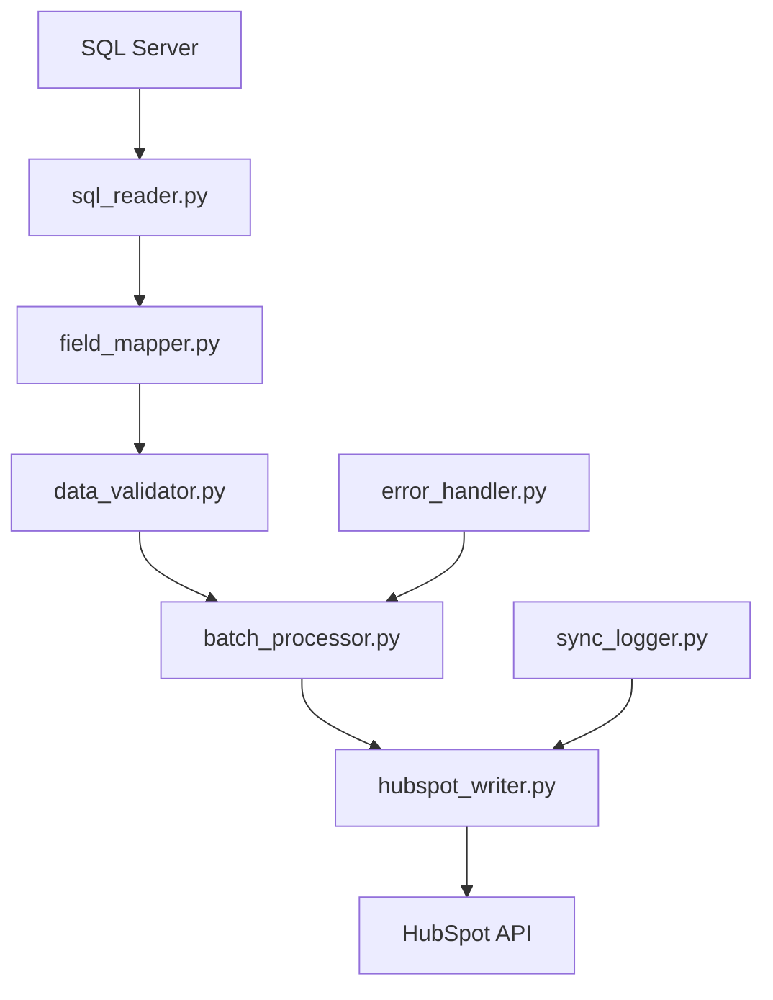

# 📤 HubSpot Sync - Módulo de Escritura (SQL → HubSpot)

## 📋 Descripción del Proyecto

Sistema de sincronización inversa que toma datos desde SQL Server y los actualiza/inserta en HubSpot CRM. Este módulo complementa el sistema de extracción existente, permitiendo una sincronización bidireccional completa entre la base de datos corporativa y HubSpot.

## 🎯 Objetivos

### Objetivo Principal
Crear un sistema robusto y eficiente para enviar actualizaciones desde SQL Server hacia HubSpot, manteniendo la integridad de datos y optimizando el rendimiento.

### Objetivos Específicos
- ✅ **Lectura optimizada** de datos desde SQL Server
- ✅ **Mapeo inteligente** de campos SQL ↔ HubSpot
- ✅ **Detección automática** de registros nuevos vs existentes
- ✅ **Operaciones masivas** (batch operations) para eficiencia
- ✅ **Manejo de errores** y reintentos automáticos
- ✅ **Logging detallado** de todas las operaciones
- ✅ **Validación de datos** antes del envío

## 🏗️ Arquitectura del Sistema

### Componentes Principales

```
📁 escritura/
├── 📄 write_contacts.py       # Módulo principal de escritura de contactos
├── 📄 sql_reader.py           # Lector optimizado de SQL Server
├── 📄 hubspot_writer.py       # Escritor especializado para HubSpot API
├── 📄 field_mapper.py         # Mapeo de campos SQL ↔ HubSpot
├── 📄 data_validator.py       # Validador de datos y reglas de negocio
├── 📄 batch_processor.py      # Procesador de lotes y operaciones masivas
├── 📄 error_handler.py        # Manejo centralizado de errores
├── 📄 sync_logger.py          # Sistema de logging especializado
└── 📄 config.yaml             # Configuración de mapeos y reglas
```

### Flujo de Datos



---

**⚠️ DOCUMENTO EN CONSTRUCCIÓN ⚠️**

Este es el documento de diseño inicial del Módulo de Escritura. La implementación completa estará disponible en las siguientes fases del proyecto.

**Estado Actual**: Documentación y planificación completada ✅  
**Próxima Fase**: Implementación de módulos base  
**Fecha de Inicio Implementación**: 30 de julio de 2025  

---

**Autor**: Ing. José Ríler Solórzano Campos  
**Fecha**: 30 de julio de 2025  
**Versión**: 1.0  
**Estado**: Diseño Completado
