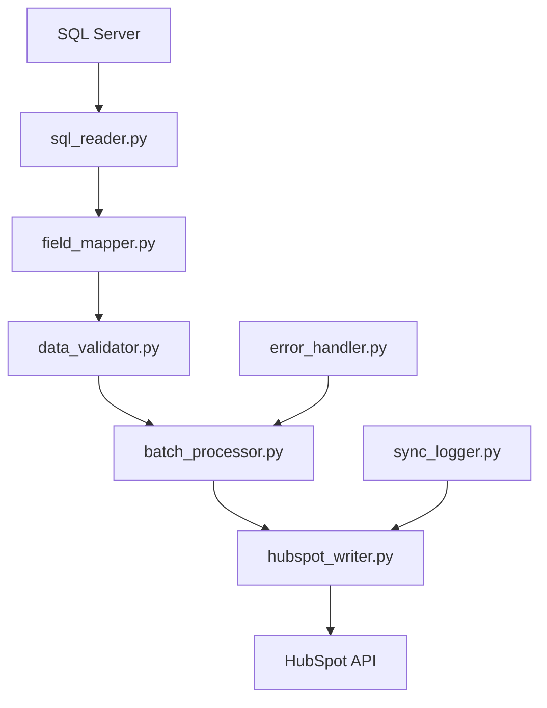

# 📤 HubSpot Sync - Módulo de Escritura (SQL → HubSpot)

## 📋 Descripción del Proyecto

Sistema de sincronización inversa que toma datos desde SQL Server y los actualiza/inserta en HubSpot CRM. Este módulo complementa el sistema de extracción existente, permitiendo una sincronización bidireccional completa entre la base de datos corporativa y HubSpot.

## 🎯 Objetivos

### Objetivo Principal
Crear un sistema robusto y eficiente para enviar actualizaciones desde SQL Server hacia HubSpot, manteniendo la integridad de datos y optimizando el rendimiento.

### Objetivos Específicos
- ✅ **Lectura optimizada** de datos desde SQL Server
- ✅ **Mapeo inteligente** de campos SQL ↔ HubSpot
- ✅ **Detección automática** de registros nuevos vs existentes
- ✅ **Operaciones masivas** (batch operations) para eficiencia
- ✅ **Manejo de errores** y reintentos automáticos
- ✅ **Logging detallado** de todas las operaciones
- ✅ **Validación de datos** antes del envío

## 🏗️ Arquitectura del Sistema

### Componentes Principales

```
📁 escritura/
├── 📄 write_contacts.py       # Módulo principal de escritura de contactos
├── 📄 sql_reader.py           # Lector optimizado de SQL Server
├── 📄 hubspot_writer.py       # Escritor especializado para HubSpot API
├── 📄 field_mapper.py         # Mapeo de campos SQL ↔ HubSpot
├── 📄 data_validator.py       # Validador de datos y reglas de negocio
├── 📄 batch_processor.py      # Procesador de lotes y operaciones masivas
├── 📄 error_handler.py        # Manejo centralizado de errores
├── 📄 sync_logger.py          # Sistema de logging especializado
└── 📄 config.yaml             # Configuración de mapeos y reglas
```

### Flujo de Datos



## 📊 Casos de Uso

### 🔑 Criterio de Validación Único: Número de Cédula
**IMPORTANTE**: El sistema utilizará exclusivamente el campo `no__de_cedula` como identificador único para determinar si un contacto existe en HubSpot o debe ser creado.

### 1. Actualización de Contactos Existentes
- **Escenario**: Contacto con cédula X existe en HubSpot
- **Validación**: Búsqueda en HubSpot por `no__de_cedula`
- **Acción**: UPDATE en HubSpot con todos los datos actualizados de SQL
- **API**: `PUT /crm/v3/objects/contacts/{contactId}`

### 2. Inserción de Contactos Nuevos  
- **Escenario**: Contacto con cédula X NO existe en HubSpot
- **Validación**: Búsqueda en HubSpot por `no__de_cedula` retorna 404
- **Acción**: INSERT en HubSpot con datos completos de SQL
- **API**: `POST /crm/v3/objects/contacts`

### 3. Sincronización Masiva
- **Escenario**: Migración inicial o sincronización completa
- **Estrategia**: Por cada registro de SQL, verificar existencia por cédula
- **Optimización**: Batch de búsquedas y operaciones agrupadas
- **API**: `POST /crm/v3/objects/contacts/batch/read` → `POST /crm/v3/objects/contacts/batch/update` o `POST /crm/v3/objects/contacts/batch/create`

## 🗺️ Mapeo de Campos

### Campos Críticos de Contactos

| Campo SQL | Campo HubSpot | Tipo | Requerido | Validación |
|-----------|---------------|------|-----------|------------|
| `numero_asociado` | `numero_asociado` | text | ✅ | Formato específico |
| `no__de_cedula` | `no__de_cedula` | text | ✅ | Validación cédula CR |
| `firstname` | `firstname` | text | ✅ | No vacío |
| `lastname` | `lastname` | text | ✅ | No vacío |
| `email` | `email` | email | ✅ | Formato email válido |
| `hs_whatsapp_phone_number` | `hs_whatsapp_phone_number` | phone | ❌ | Formato teléfono |
| `telefono_habitacion` | `telefono_habitacion` | phone | ❌ | Formato teléfono |
| `telefono_oficina` | `telefono_oficina` | phone | ❌ | Formato teléfono |
| `date_of_birth` | `date_of_birth` | date | ❌ | Formato ISO |
| `marital_status` | `marital_status` | enumeration | ❌ | Valores predefinidos |
| `provincia` | `provincia` | text | ❌ | Lista válida |
| `canton` | `canton` | text | ❌ | Lista válida |
| `distrito` | `distrito` | text | ❌ | Lista válida |

### Campos Financieros

| Campo SQL | Campo HubSpot | Tipo | Validación |
|-----------|---------------|------|------------|
| `salario_neto_semanal_o_quincenal` | `salario_neto_semanal_o_quincenal` | number | Valor positivo |
| `salario_bruto_semanal_o_quincenal` | `salario_bruto_semanal_o_quincenal` | number | Valor positivo |
| `frecuencia_deposito_de_su_salario` | `frecuencia_deposito_de_su_salario` | enumeration | Valores válidos |

### Campos de Beneficiarios

| Campo SQL | Campo HubSpot | Tipo | Validación |
|-----------|---------------|------|------------|
| `nombre_y_apellidos__beneficiario_01_` | `nombre_y_apellidos__beneficiario_01_` | text | Formato nombre |
| `numero_de_cedula__beneficiario_1_` | `numero_de_cedula__beneficiario_1_` | text | Formato cédula |
| `porcentaje__beneficiario_1_` | `porcentaje__beneficiario_1_` | number | 0-100% |

## 🔄 Estrategias de Sincronización

### 🔑 Estrategia Principal: Validación por Número de Cédula

```python
# Algoritmo principal de sincronización
def sync_contact_by_cedula(sql_record):
    cedula = sql_record['no__de_cedula']
    
    # 1. Buscar contacto existente en HubSpot por cédula
    existing_contact = hubspot_api.search_contact_by_cedula(cedula)
    
    if existing_contact:
        # 2a. ACTUALIZAR: Contacto existe
        return hubspot_api.update_contact(existing_contact.id, sql_record)
    else:
        # 2b. INSERTAR: Contacto no existe
        return hubspot_api.create_contact(sql_record)
```

### 1. Sincronización Incremental
```sql
-- Solo registros modificados recientemente
SELECT no__de_cedula, firstname, lastname, email, 
       numero_asociado, telefono_habitacion, ...
FROM hb_contacts 
WHERE lastmodifieddate > @last_sync_date
  AND no__de_cedula IS NOT NULL
  AND no__de_cedula != ''
ORDER BY lastmodifieddate ASC
```

### 2. Sincronización por Lotes con Verificación de Cédula
```python
# Procesar en lotes optimizados por cédula
BATCH_SIZE = 100

def process_batch_by_cedula(sql_records):
    # 1. Extraer todas las cédulas del lote
    cedulas = [r['no__de_cedula'] for r in sql_records]
    
    # 2. Buscar contactos existentes en HubSpot (batch)
    existing_contacts = hubspot_api.search_contacts_by_cedulas(cedulas)
    
    # 3. Separar en operaciones INSERT vs UPDATE
    updates = []
    inserts = []
    
    for record in sql_records:
        cedula = record['no__de_cedula']
        if cedula in existing_contacts:
            updates.append({
                'id': existing_contacts[cedula]['id'],
                'properties': map_sql_to_hubspot(record)
            })
        else:
            inserts.append({
                'properties': map_sql_to_hubspot(record)
            })
    
    # 4. Ejecutar operaciones batch
    if updates:
        hubspot_api.batch_update_contacts(updates)
    if inserts:
        hubspot_api.batch_create_contacts(inserts)
```

### 3. Detección de Cambios con Cédula como Clave
```python
# Validación específica por cédula
def needs_update(sql_record, hubspot_contact):
    # Comparar timestamp o campos específicos
    sql_modified = sql_record.get('lastmodifieddate')
    hubspot_modified = hubspot_contact.get('hs_lastmodifieddate')
    
    if sql_modified and hubspot_modified:
        return sql_modified > hubspot_modified
    
    # Si no hay timestamps, comparar campos críticos
    return has_field_changes(sql_record, hubspot_contact)

def has_field_changes(sql_record, hubspot_contact):
    critical_fields = ['firstname', 'lastname', 'email', 'telefono_habitacion']
    for field in critical_fields:
        sql_value = sql_record.get(field, '').strip()
        hubspot_value = hubspot_contact.get(field, '').strip()
        if sql_value != hubspot_value:
            return True
    return False
```

## 🛡️ Validaciones y Reglas de Negocio

### 🔑 Validaciones Críticas (Basadas en Cédula)

1. **🆔 CÉDULA OBLIGATORIA**: Campo `no__de_cedula` es REQUERIDO y ÚNICO
   - Formato: Validación según reglas costarricenses
   - Unicidad: No puede haber duplicados en HubSpot
   - **BLOQUEO**: Sin cédula válida, el registro NO se procesa

2. **Búsqueda Optimizada**: Todos los contactos se buscan/validan por cédula
3. **Número Asociado**: Formato específico de la cooperativa  
4. **Campos Mínimos**: firstname, lastname, email (después de la cédula)
5. **Beneficiarios**: Suma de porcentajes = 100%

### Validación Específica de Cédula Costarricense

```python
import re

def validate_cedula_costarricense(cedula):
    """
    Valida formato de cédula costarricense
    Formatos aceptados:
    - Físicas: 1-1234-5678 (9 dígitos)
    - Jurídicas: 3-101-123456 (10 dígitos)
    - DIMEX: 122345678901 (12 dígitos)
    """
    if not cedula:
        return False, "Cédula no puede estar vacía"
    
    # Limpiar cédula (remover espacios y guiones)
    clean_cedula = re.sub(r'[\s\-]', '', str(cedula))
    
    # Validar solo números
    if not clean_cedula.isdigit():
        return False, "Cédula debe contener solo números"
    
    # Validar longitud
    if len(clean_cedula) == 9:
        # Cédula física: formato 1-1234-5678
        return True, "Cédula física válida"
    elif len(clean_cedula) == 10:
        # Cédula jurídica: formato 3-101-123456
        return True, "Cédula jurídica válida"
    elif len(clean_cedula) == 12:
        # DIMEX: formato 122345678901
        return True, "DIMEX válido"
    else:
        return False, f"Longitud inválida: {len(clean_cedula)} dígitos"

def normalize_cedula(cedula):
    """Normaliza cédula para búsqueda consistente"""
    if not cedula:
        return None
    return re.sub(r'[\s\-]', '', str(cedula)).strip()
```

### Reglas de Transformación con Enfoque en Cédula

```python
# Pipeline de validación centrado en cédula
def validate_and_transform_record(sql_record):
    errors = []
    
    # 1. VALIDACIÓN CRÍTICA: Cédula
    cedula = sql_record.get('no__de_cedula')
    is_valid, message = validate_cedula_costarricense(cedula)
    if not is_valid:
        errors.append(f"CÉDULA INVÁLIDA: {message}")
        return None, errors  # DETENER procesamiento
    
    # 2. Normalizar cédula para búsqueda
    sql_record['no__de_cedula'] = normalize_cedula(cedula)
    
    # 3. Otras validaciones secundarias
    if not sql_record.get('firstname', '').strip():
        errors.append("Nombre requerido")
    
    if not sql_record.get('lastname', '').strip():
        errors.append("Apellido requerido")
    
    # 4. Transformaciones de datos
    sql_record = normalize_phone_fields(sql_record)
    sql_record = transform_marital_status(sql_record)
    
    return sql_record, errors

# Ejemplo: Normalización de teléfonos
def normalize_phone(phone):
    if not phone or phone == '22120000':
        return None
    return clean_phone(phone)

# Ejemplo: Estado civil
MARITAL_STATUS_MAP = {
    '1': 'Soltero',
    '2': 'Casado', 
    '3': 'Divorciado',
    '4': 'Viudo',
    '5': 'Unión Libre'
}
```

## ⚡ Optimizaciones de Rendimiento

### 1. Batch Operations
- Usar `/crm/v3/objects/contacts/batch/update`
- Máximo 100 registros por batch
- Procesamiento paralelo cuando sea posible

### 2. Caching Inteligente
- Cache de propiedades de HubSpot
- Cache de contactos existentes para evitar búsquedas repetidas
- TTL configurable para refresh automático

### 3. Rate Limiting
- Respetar límites de API de HubSpot (100 requests/10 seconds)
- Implementar exponential backoff
- Queue de requests con priorización

## 🔍 Logging y Monitoreo

### Niveles de Log (Centrado en Cédula)

```python
# Estructura de logging optimizada para cédula
{
    "timestamp": "2025-07-30T10:00:00Z",
    "level": "INFO|WARN|ERROR",
    "operation": "INSERT|UPDATE|BATCH|SEARCH",
    "cedula": "123456789",           # 🔑 Campo crítico
    "contact_id": "12345",
    "hubspot_id": "67890", 
    "status": "SUCCESS|FAILED|RETRY|SKIPPED",
    "message": "Descripción detallada",
    "execution_time": "0.5s",
    "batch_id": "batch_001",
    "validation_errors": ["campo1", "campo2"]
}

# Ejemplos específicos de log por cédula
{
    "level": "INFO",
    "operation": "SEARCH",
    "cedula": "123456789",
    "message": "Contacto encontrado en HubSpot, proceder con UPDATE"
}

{
    "level": "INFO", 
    "operation": "INSERT",
    "cedula": "987654321",
    "hubspot_id": "12345",
    "message": "Nuevo contacto creado exitosamente"
}

{
    "level": "ERROR",
    "operation": "VALIDATION",
    "cedula": "invalid123",
    "status": "SKIPPED",
    "message": "Cédula inválida: Longitud inválida: 9 dígitos esperados"
}
```

### Métricas de Monitoreo (Con Enfoque en Cédula)

- ✅ **Registros procesados por minuto**
- ✅ **Tasa de éxito/error por cédula**
- ✅ **Tiempo promedio por operación** 
- ✅ **Contactos encontrados vs nuevos** (ratio UPDATE/INSERT)
- ✅ **Cédulas inválidas detectadas**
- ✅ **Uso de API quota**
- ✅ **Registros pendientes en queue**

### Dashboard de Monitoreo en Tiempo Real

```python
# Métricas específicas del sistema de cédula
class SyncMetrics:
    def __init__(self):
        self.total_processed = 0
        self.contacts_updated = 0      # Existían en HubSpot
        self.contacts_inserted = 0     # Nuevos en HubSpot  
        self.cedulas_invalid = 0       # Cédulas rechazadas
        self.api_calls_search = 0      # Búsquedas por cédula
        self.api_calls_write = 0       # Escrituras a HubSpot
        
    def get_insert_update_ratio(self):
        total_ops = self.contacts_updated + self.contacts_inserted
        if total_ops == 0:
            return 0, 0
        return (
            (self.contacts_updated / total_ops) * 100,
            (self.contacts_inserted / total_ops) * 100
        )
```

## 🚨 Manejo de Errores

### Categorías de Error

1. **Errores de Conexión**
   - SQL Server no disponible
   - HubSpot API no responde
   - **Acción**: Retry con backoff

2. **Errores de Validación**
   - Datos inválidos
   - Campos requeridos faltantes
   - **Acción**: Log error, continuar con siguiente

3. **Errores de API**
   - Rate limit exceeded
   - Contacto no encontrado
   - **Acción**: Queue para retry

4. **Errores de Negocio**
   - Duplicados detectados
   - Reglas de validación fallidas
   - **Acción**: Marcaje manual requerido

### Estrategias de Recuperación

```python
class RetryStrategy:
    max_retries = 3
    backoff_factor = 2
    retry_statuses = [429, 500, 502, 503, 504]
    
    def should_retry(self, error):
        return error.status_code in self.retry_statuses
```

## 📁 Estructura de Archivos

### Configuraciones

```yaml
# config.yaml
sql_connection:
  server: "${SQL_SERVER}"
  database: "${SQL_DATABASE}"
  
hubspot:
  batch_size: 100
  rate_limit: 100
  timeout: 30
  
field_mappings:
  contacts:
    numero_asociado: numero_asociado
    no__de_cedula: no__de_cedula
    # ... más mapeos

validation_rules:
  required_fields: [firstname, lastname, email]
  phone_format: "costa_rica"
  cedula_validation: true
```

### Scripts de Ejemplo (Basados en Cédula)

```python
# Uso básico: Sincronización por cédula
from escritura.write_contacts import ContactWriter

writer = ContactWriter()

# 1. Sincronización incremental (solo cambios recientes)
results = writer.sync_from_sql(
    query="""
        SELECT no__de_cedula, firstname, lastname, email, 
               numero_asociado, telefono_habitacion, lastmodifieddate
        FROM hb_contacts 
        WHERE lastmodifieddate > DATEADD(hour, -1, GETDATE())
          AND no__de_cedula IS NOT NULL
          AND no__de_cedula != ''
    """,
    operation="upsert_by_cedula"  # Operación específica por cédula
)

print(f"📊 RESULTADOS DE SINCRONIZACIÓN:")
print(f"   Total procesados: {results.total}")
print(f"   ✅ Actualizados: {results.updated}")  # Existían en HubSpot
print(f"   ➕ Insertados: {results.inserted}")   # Nuevos en HubSpot
print(f"   ❌ Errores: {results.errors}")
print(f"   ⚠️  Cédulas inválidas: {results.invalid_cedulas}")

# 2. Sincronización de un contacto específico por cédula
single_result = writer.sync_contact_by_cedula("123456789")
if single_result.success:
    print(f"✅ Contacto con cédula 123456789 sincronizado")
    print(f"   Operación: {single_result.operation}")  # INSERT o UPDATE
    print(f"   HubSpot ID: {single_result.hubspot_id}")
else:
    print(f"❌ Error: {single_result.error_message}")

# 3. Ejemplo de uso avanzado con filtros
results = writer.sync_from_sql(
    query="""
        SELECT * FROM hb_contacts 
        WHERE provincia = 'San José'
          AND no__de_cedula IS NOT NULL
        ORDER BY lastmodifieddate DESC
    """,
    operation="upsert_by_cedula",
    batch_size=50,  # Procesar en lotes de 50
    validate_before_sync=True  # Validar antes de enviar
)

# 4. Manejo detallado de resultados
for error in results.detailed_errors:
    print(f"❌ Cédula {error.cedula}: {error.message}")

for success in results.detailed_success:
    operation = "📝 Actualizado" if success.was_update else "➕ Creado"
    print(f"✅ {operation}: {success.cedula} → HubSpot ID: {success.hubspot_id}")
```

### Ejemplo de Configuración Específica

```python
# Configuración personalizada para cédula
writer = ContactWriter(config={
    'cedula_validation': {
        'strict_mode': True,           # Rechazar cédulas inválidas
        'normalize_format': True,      # Limpiar guiones y espacios
        'validate_checksum': False     # Para cédulas con dígito verificador
    },
    'search_strategy': {
        'field': 'no__de_cedula',      # Campo de búsqueda principal
        'exact_match': True,           # Búsqueda exacta
        'case_sensitive': False        # No sensible a mayúsculas
    },
    'operation_priority': {
        'prefer_update': True,         # Preferir UPDATE sobre INSERT
        'create_if_missing': True      # Crear si no existe
    }
})
```

## 🧪 Testing y Calidad

### Test Cases Críticos (Basados en Cédula)

1. **✅ Test de Inserción por Cédula**
   - **Escenario**: Cédula `123456789` existe en SQL pero no en HubSpot
   - **Acción**: `writer.sync_contact_by_cedula("123456789")`
   - **Resultado Esperado**: `INSERT` exitoso, retorna HubSpot ID nuevo

2. **📝 Test de Actualización por Cédula**
   - **Escenario**: Cédula `987654321` existe en ambos sistemas
   - **Acción**: Modificar datos en SQL, ejecutar sync
   - **Resultado Esperado**: `UPDATE` exitoso, datos actualizados en HubSpot

3. **❌ Test de Validación de Cédula**
   - **Escenario**: Cédula inválida `invalid123`
   - **Acción**: Intentar sincronización
   - **Resultado Esperado**: Rechazo inmediato, error descriptivo

4. **📦 Test de Batch por Cédula**
   - **Escenario**: 1000 registros con cédulas mixtas (algunas existen, otras no)
   - **Acción**: Batch processing
   - **Resultado Esperado**: Separación correcta en UPDATEs/INSERTs

5. **🔄 Test de Recuperación de Errores**
   - **Escenario**: API de HubSpot retorna error 429 (rate limit)
   - **Acción**: Verificar retry automático
   - **Resultado Esperado**: Reintentos con backoff exponencial

6. **🔍 Test de Búsqueda por Cédula**
   - **Escenario**: Cédula con diferentes formatos (`1-2345-6789` vs `123456789`)
   - **Acción**: Búsqueda normalizada
   - **Resultado Esperado**: Encuentra contacto independiente del formato

### Casos de Prueba Específicos

```python
import pytest
from escritura.write_contacts import ContactWriter

class TestCedulaSync:
    
    def test_insert_new_cedula(self):
        """Test inserción de contacto con cédula nueva"""
        writer = ContactWriter()
        
        # Mock: Cédula no existe en HubSpot
        mock_sql_record = {
            'no__de_cedula': '123456789',
            'firstname': 'Juan',
            'lastname': 'Pérez',
            'email': 'juan@test.com'
        }
        
        result = writer.sync_contact_by_cedula('123456789')
        
        assert result.operation == 'INSERT'
        assert result.success == True
        assert result.hubspot_id is not None
    
    def test_update_existing_cedula(self):
        """Test actualización de contacto existente"""
        writer = ContactWriter()
        
        # Mock: Cédula existe en HubSpot
        result = writer.sync_contact_by_cedula('987654321')
        
        assert result.operation == 'UPDATE'
        assert result.success == True
        assert result.hubspot_id is not None
    
    def test_invalid_cedula_rejection(self):
        """Test rechazo de cédula inválida"""
        writer = ContactWriter()
        
        result = writer.sync_contact_by_cedula('invalid123')
        
        assert result.success == False
        assert 'Cédula inválida' in result.error_message
    
    def test_batch_mixed_cedulas(self):
        """Test batch con cédulas mixtas"""
        writer = ContactWriter()
        
        sql_query = """
            SELECT no__de_cedula, firstname, lastname, email
            FROM test_contacts 
            WHERE batch_test = 1
        """
        
        results = writer.sync_from_sql(sql_query)
        
        assert results.total > 0
        assert results.updated + results.inserted == results.total - results.errors
        assert results.invalid_cedulas >= 0
```

### Ambientes de Testing

- **Development**: HubSpot Sandbox + SQL Test DB
- **Staging**: HubSpot Sandbox + SQL Staging
- **Production**: HubSpot Production + SQL Production

## 📅 Plan de Implementación

### Fase 1: Base (Semana 1)
- ✅ Configuración de proyecto
- ✅ SQL Reader básico
- ✅ HubSpot Writer básico
- ✅ Mapeo de campos core

### Fase 2: Lógica de Negocio (Semana 2)
- ✅ Data Validator
- ✅ Field Mapper completo
- ✅ Batch Processor
- ✅ Error Handler

### Fase 3: Optimización (Semana 3)
- ✅ Caching system
- ✅ Rate limiting
- ✅ Performance tuning
- ✅ Comprehensive logging

### Fase 4: Testing y Deploy (Semana 4)
- ✅ Unit tests
- ✅ Integration tests
- ✅ Performance tests
- ✅ Production deployment

## 🔐 Consideraciones de Seguridad

### Datos Sensibles
- Nunca loggear passwords o tokens
- Encriptar datos en tránsito
- Usar variables de entorno para credenciales

### Acceso y Permisos
- Principio de menor privilegio
- Auditoría de accesos
- Rotación regular de tokens

## 📈 Métricas de Éxito

### KPIs Técnicos
- **Throughput**: > 1000 contactos/hora
- **Accuracy**: > 99.5% de datos correctos
- **Availability**: > 99.9% uptime
- **Performance**: < 2s promedio por batch

### KPIs de Negocio
- **Data Freshness**: < 1 hora de lag
- **Error Rate**: < 0.1% de fallos
- **Coverage**: 100% de campos críticos
- **Compliance**: 100% adherencia a reglas

## 🔄 Mantenimiento y Evolución

### Monitoreo Continuo
- Dashboards en tiempo real
- Alertas automáticas
- Reports semanales de performance

### Evolución del Sistema
- Nuevos campos según necesidades
- Optimizaciones de performance
- Integración con otros sistemas

---

## 📝 Notas de Desarrollo

### Tecnologías Utilizadas
- **Python 3.13+**: Lenguaje principal
- **pyodbc**: Conexión SQL Server
- **requests**: HubSpot API calls
- **pydantic**: Validación de datos
- **asyncio**: Operaciones asíncronas
- **pytest**: Testing framework

### Consideraciones Especiales
- Manejo de timezone (UTC vs local)
- Caracteres especiales en nombres
- Formatos de fecha regionales
- **Validaciones específicas de Costa Rica**
- **🔑 CÉDULA como campo único de validación**

---

## 🎯 RESUMEN EJECUTIVO: Especificación de Cédula Única

### ⚡ Decisión Técnica Principal
**El sistema utilizará EXCLUSIVAMENTE el campo `no__de_cedula` como criterio único para determinar operaciones de sincronización:**

### 🔄 Flujo Simplificado
```
1. ➡️  Leer registro de SQL Server
2. 🔍 Buscar en HubSpot por no__de_cedula
3. ❓ ¿Existe?
   ├── ✅ SÍ  → UPDATE (actualizar datos)
   └── ❌ NO  → INSERT (crear nuevo)
4. 📝 Log resultado por cédula
```

### 🎯 Beneficios de esta Aproximación
- **✅ Simplicidad**: Un solo campo de validación
- **✅ Consistencia**: Sin ambigüedad en la lógica
- **✅ Performance**: Búsquedas optimizadas por cédula
- **✅ Auditoría**: Trazabilidad clara por cédula
- **✅ Escalabilidad**: Batch operations eficientes

### 🚫 Campos NO Utilizados para Validación
- ❌ `email` (puede cambiar)
- ❌ `numero_asociado` (puede cambiar)
- ❌ `firstname + lastname` (pueden cambiar)
- ❌ Combinaciones de campos

### ⚠️ Requisitos Críticos
1. **Campo `no__de_cedula` OBLIGATORIO** en SQL
2. **Validación de formato costarricense** antes de procesar
3. **Normalización de formato** para búsquedas consistentes
4. **Manejo de errores** para cédulas inválidas

---

**Autor**: Ing. José Ríler Solórzano Campos  
**Fecha**: 30 de julio de 2025  
**Versión**: 1.1 - Especificación de Cédula Única  
**Estado**: Documentación Actualizada
