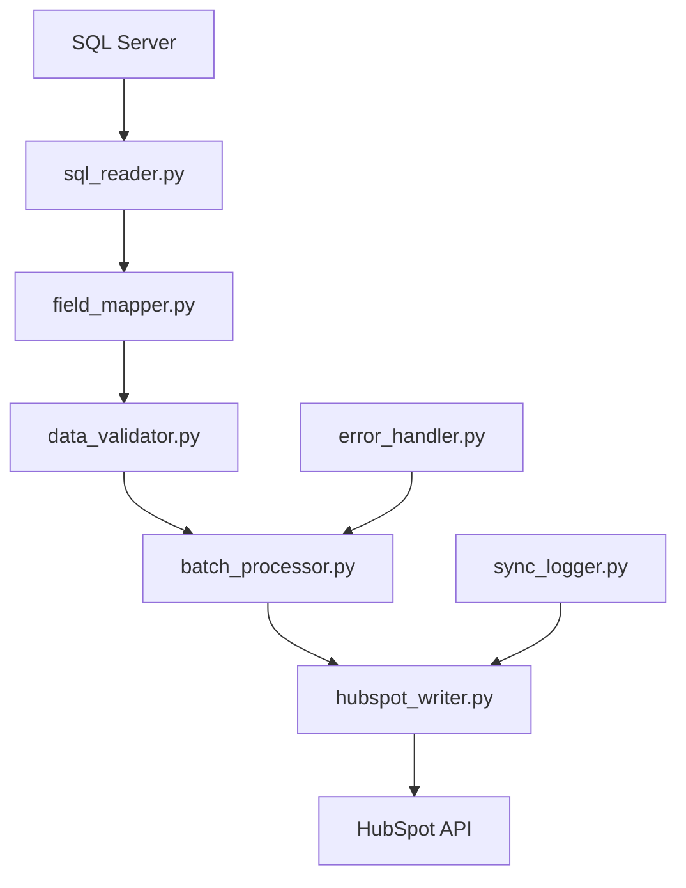

# 📤 HubSpot Sync - Módulo de Escritura (SQL → HubSpot)

## 📋 Descripción del Proyecto

Sistema de sincronización inversa que toma datos desde SQL Server y los actualiza/inserta en HubSpot CRM. Este módulo complementa el sistema de extracción existente, permitiendo una sincronización bidireccional completa entre la base de datos corporativa y HubSpot.

## 🎯 Objetivos

### Objetivo Principal
Crear un sistema robusto y eficiente para enviar actualizaciones desde SQL Server hacia HubSpot, manteniendo la integridad de datos y optimizando el rendimiento.

### Objetivos Específicos
- ✅ **Lectura optimizada** de datos desde SQL Server
- ✅ **Mapeo inteligente** de campos SQL ↔ HubSpot
- ✅ **Detección automática** de registros nuevos vs existentes
- ✅ **Operaciones masivas** (batch operations) para eficiencia
- ✅ **Manejo de errores** y reintentos automáticos
- ✅ **Logging detallado** de todas las operaciones
- ✅ **Validación de datos** antes del envío

## 🏗️ Arquitectura del Sistema

### Componentes Principales

```
📁 escritura/
├── 📄 write_contacts.py       # Módulo principal de escritura de contactos
├── 📄 sql_reader.py           # Lector optimizado de SQL Server
├── 📄 hubspot_writer.py       # Escritor especializado para HubSpot API
├── 📄 field_mapper.py         # Mapeo de campos SQL ↔ HubSpot
├── 📄 data_validator.py       # Validador de datos y reglas de negocio
├── 📄 batch_processor.py      # Procesador de lotes y operaciones masivas
├── 📄 error_handler.py        # Manejo centralizado de errores
├── 📄 sync_logger.py          # Sistema de logging especializado
└── 📄 config.yaml             # Configuración de mapeos y reglas
```

### Flujo de Datos



## 📊 Casos de Uso

### 1. Actualización de Contactos Existentes
- **Escenario**: Contacto existe en HubSpot y SQL
- **Acción**: UPDATE en HubSpot con datos de SQL
- **Criterio**: Comparar por email o número de identificación

### 2. Inserción de Contactos Nuevos
- **Escenario**: Contacto existe en SQL pero no en HubSpot
- **Acción**: INSERT en HubSpot con datos completos de SQL
- **Criterio**: Verificación previa de existencia

### 3. Sincronización Masiva
- **Escenario**: Migración inicial o sincronización completa
- **Acción**: Procesamiento por lotes de miles de registros
- **Optimización**: Uso de batch APIs de HubSpot

## 🗺️ Mapeo de Campos

### Campos Críticos de Contactos

| Campo SQL | Campo HubSpot | Tipo | Requerido | Validación |
|-----------|---------------|------|-----------|------------|
| `numero_asociado` | `numero_asociado` | text | ✅ | Formato específico |
| `no__de_cedula` | `no__de_cedula` | text | ✅ | Validación cédula CR |
| `firstname` | `firstname` | text | ✅ | No vacío |
| `lastname` | `lastname` | text | ✅ | No vacío |
| `email` | `email` | email | ✅ | Formato email válido |
| `hs_whatsapp_phone_number` | `hs_whatsapp_phone_number` | phone | ❌ | Formato teléfono |
| `telefono_habitacion` | `telefono_habitacion` | phone | ❌ | Formato teléfono |
| `telefono_oficina` | `telefono_oficina` | phone | ❌ | Formato teléfono |
| `date_of_birth` | `date_of_birth` | date | ❌ | Formato ISO |
| `marital_status` | `marital_status` | enumeration | ❌ | Valores predefinidos |
| `provincia` | `provincia` | text | ❌ | Lista válida |
| `canton` | `canton` | text | ❌ | Lista válida |
| `distrito` | `distrito` | text | ❌ | Lista válida |

### Campos Financieros

| Campo SQL | Campo HubSpot | Tipo | Validación |
|-----------|---------------|------|------------|
| `salario_neto_semanal_o_quincenal` | `salario_neto_semanal_o_quincenal` | number | Valor positivo |
| `salario_bruto_semanal_o_quincenal` | `salario_bruto_semanal_o_quincenal` | number | Valor positivo |
| `frecuencia_deposito_de_su_salario` | `frecuencia_deposito_de_su_salario` | enumeration | Valores válidos |

### Campos de Beneficiarios

| Campo SQL | Campo HubSpot | Tipo | Validación |
|-----------|---------------|------|------------|
| `nombre_y_apellidos__beneficiario_01_` | `nombre_y_apellidos__beneficiario_01_` | text | Formato nombre |
| `numero_de_cedula__beneficiario_1_` | `numero_de_cedula__beneficiario_1_` | text | Formato cédula |
| `porcentaje__beneficiario_1_` | `porcentaje__beneficiario_1_` | number | 0-100% |

## 🔄 Estrategias de Sincronización

### 1. Sincronización Incremental
```sql
-- Solo registros modificados recientemente
SELECT * FROM hb_contacts 
WHERE lastmodifieddate > @last_sync_date
ORDER BY lastmodifieddate ASC
```

### 2. Sincronización por Lotes
```python
# Procesar en lotes de 100 registros
BATCH_SIZE = 100
for batch in chunked(records, BATCH_SIZE):
    process_batch(batch)
```

### 3. Detección de Cambios
```python
# Comparar checksums o timestamps
def has_changed(sql_record, hubspot_record):
    return sql_record['lastmodified'] > hubspot_record['lastmodified']
```

## 🛡️ Validaciones y Reglas de Negocio

### Validaciones Críticas

1. **Email Único**: Verificar que no exista duplicado en HubSpot
2. **Cédula Válida**: Validación según formato costarricense
3. **Número Asociado**: Formato específico de la cooperativa
4. **Campos Requeridos**: firstname, lastname, email mínimos
5. **Beneficiarios**: Suma de porcentajes = 100%

### Reglas de Transformación

```python
# Ejemplo: Normalización de teléfonos
def normalize_phone(phone):
    if phone == '22120000':
        return None
    return clean_phone(phone)

# Ejemplo: Estado civil
MARITAL_STATUS_MAP = {
    '1': 'Soltero',
    '2': 'Casado', 
    '3': 'Divorciado',
    '4': 'Viudo',
    '5': 'Unión Libre'
}
```

## ⚡ Optimizaciones de Rendimiento

### 1. Batch Operations
- Usar `/crm/v3/objects/contacts/batch/update`
- Máximo 100 registros por batch
- Procesamiento paralelo cuando sea posible

### 2. Caching Inteligente
- Cache de propiedades de HubSpot
- Cache de contactos existentes para evitar búsquedas repetidas
- TTL configurable para refresh automático

### 3. Rate Limiting
- Respetar límites de API de HubSpot (100 requests/10 seconds)
- Implementar exponential backoff
- Queue de requests con priorización

## 🔍 Logging y Monitoreo

### Niveles de Log

```python
# Estructura de logging
{
    "timestamp": "2025-07-30T10:00:00Z",
    "level": "INFO|WARN|ERROR",
    "operation": "INSERT|UPDATE|BATCH",
    "contact_id": "12345",
    "hubspot_id": "67890",
    "status": "SUCCESS|FAILED|RETRY",
    "message": "Descripción detallada",
    "execution_time": "0.5s",
    "batch_id": "batch_001"
}
```

### Métricas de Monitoreo

- ✅ **Registros procesados por minuto**
- ✅ **Tasa de éxito/error**
- ✅ **Tiempo promedio por operación**
- ✅ **Uso de API quota**
- ✅ **Registros pendientes en queue**

## 🚨 Manejo de Errores

### Categorías de Error

1. **Errores de Conexión**
   - SQL Server no disponible
   - HubSpot API no responde
   - **Acción**: Retry con backoff

2. **Errores de Validación**
   - Datos inválidos
   - Campos requeridos faltantes
   - **Acción**: Log error, continuar con siguiente

3. **Errores de API**
   - Rate limit exceeded
   - Contacto no encontrado
   - **Acción**: Queue para retry

4. **Errores de Negocio**
   - Duplicados detectados
   - Reglas de validación fallidas
   - **Acción**: Marcaje manual requerido

### Estrategias de Recuperación

```python
class RetryStrategy:
    max_retries = 3
    backoff_factor = 2
    retry_statuses = [429, 500, 502, 503, 504]
    
    def should_retry(self, error):
        return error.status_code in self.retry_statuses
```

## 📁 Estructura de Archivos

### Configuraciones

```yaml
# config.yaml
sql_connection:
  server: "${SQL_SERVER}"
  database: "${SQL_DATABASE}"
  
hubspot:
  batch_size: 100
  rate_limit: 100
  timeout: 30
  
field_mappings:
  contacts:
    numero_asociado: numero_asociado
    no__de_cedula: no__de_cedula
    # ... más mapeos

validation_rules:
  required_fields: [firstname, lastname, email]
  phone_format: "costa_rica"
  cedula_validation: true
```

### Scripts de Ejemplo

```python
# Uso básico
from escritura.write_contacts import ContactWriter

writer = ContactWriter()
results = writer.sync_from_sql(
    query="SELECT * FROM hb_contacts WHERE modified_today = 1",
    operation="upsert"  # insert, update, upsert
)

print(f"Procesados: {results.total}")
print(f"Éxito: {results.success}")
print(f"Errores: {results.errors}")
```

## 🧪 Testing y Calidad

### Test Cases Críticos

1. **Test de Inserción**: Contacto nuevo en SQL → HubSpot
2. **Test de Actualización**: Contacto existente modificado
3. **Test de Validación**: Datos inválidos rechazan correctamente
4. **Test de Batch**: 1000 registros procesan correctamente
5. **Test de Error**: Recuperación de errores de API

### Ambientes de Testing

- **Development**: HubSpot Sandbox + SQL Test DB
- **Staging**: HubSpot Sandbox + SQL Staging
- **Production**: HubSpot Production + SQL Production

## 📅 Plan de Implementación

### Fase 1: Base (Semana 1)
- ✅ Configuración de proyecto
- ✅ SQL Reader básico
- ✅ HubSpot Writer básico
- ✅ Mapeo de campos core

### Fase 2: Lógica de Negocio (Semana 2)
- ✅ Data Validator
- ✅ Field Mapper completo
- ✅ Batch Processor
- ✅ Error Handler

### Fase 3: Optimización (Semana 3)
- ✅ Caching system
- ✅ Rate limiting
- ✅ Performance tuning
- ✅ Comprehensive logging

### Fase 4: Testing y Deploy (Semana 4)
- ✅ Unit tests
- ✅ Integration tests
- ✅ Performance tests
- ✅ Production deployment

## 🔐 Consideraciones de Seguridad

### Datos Sensibles
- Nunca loggear passwords o tokens
- Encriptar datos en tránsito
- Usar variables de entorno para credenciales

### Acceso y Permisos
- Principio de menor privilegio
- Auditoría de accesos
- Rotación regular de tokens

## 📈 Métricas de Éxito

### KPIs Técnicos
- **Throughput**: > 1000 contactos/hora
- **Accuracy**: > 99.5% de datos correctos
- **Availability**: > 99.9% uptime
- **Performance**: < 2s promedio por batch

### KPIs de Negocio
- **Data Freshness**: < 1 hora de lag
- **Error Rate**: < 0.1% de fallos
- **Coverage**: 100% de campos críticos
- **Compliance**: 100% adherencia a reglas

## 🔄 Mantenimiento y Evolución

### Monitoreo Continuo
- Dashboards en tiempo real
- Alertas automáticas
- Reports semanales de performance

### Evolución del Sistema
- Nuevos campos según necesidades
- Optimizaciones de performance
- Integración con otros sistemas

---

## 📝 Notas de Desarrollo

### Tecnologías Utilizadas
- **Python 3.13+**: Lenguaje principal
- **pyodbc**: Conexión SQL Server
- **requests**: HubSpot API calls
- **pydantic**: Validación de datos
- **asyncio**: Operaciones asíncronas
- **pytest**: Testing framework

### Consideraciones Especiales
- Manejo de timezone (UTC vs local)
- Caracteres especiales en nombres
- Formatos de fecha regionales
- Validaciones específicas de Costa Rica

---

**Autor**: Ing. José Ríler Solórzano Campos  
**Fecha**: 30 de julio de 2025  
**Versión**: 1.0  
**Estado**: Diseño Inicial
